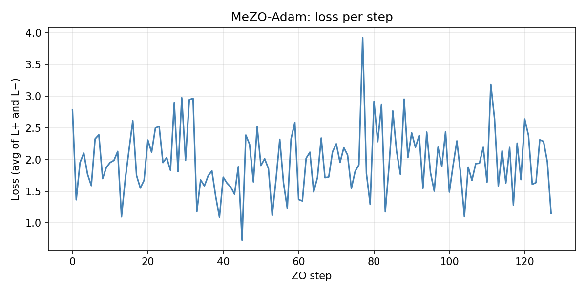
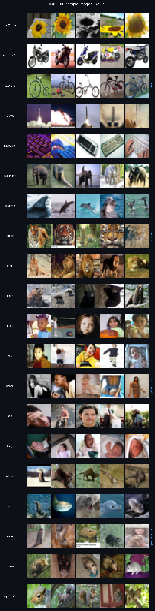
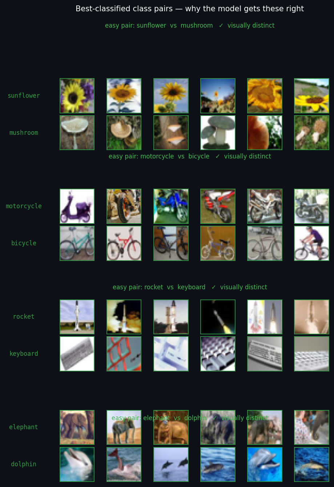
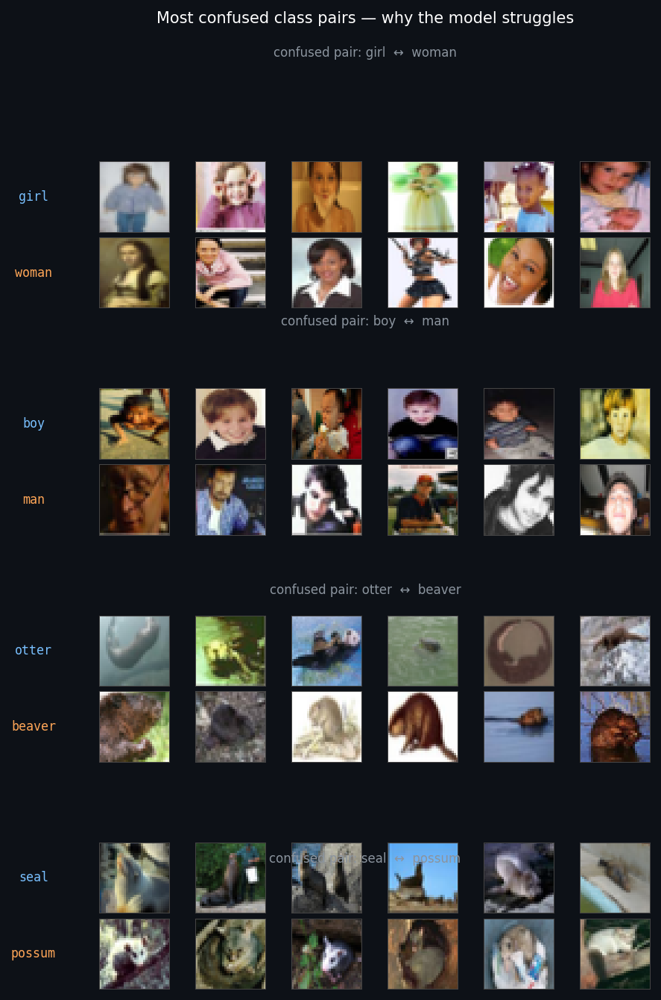
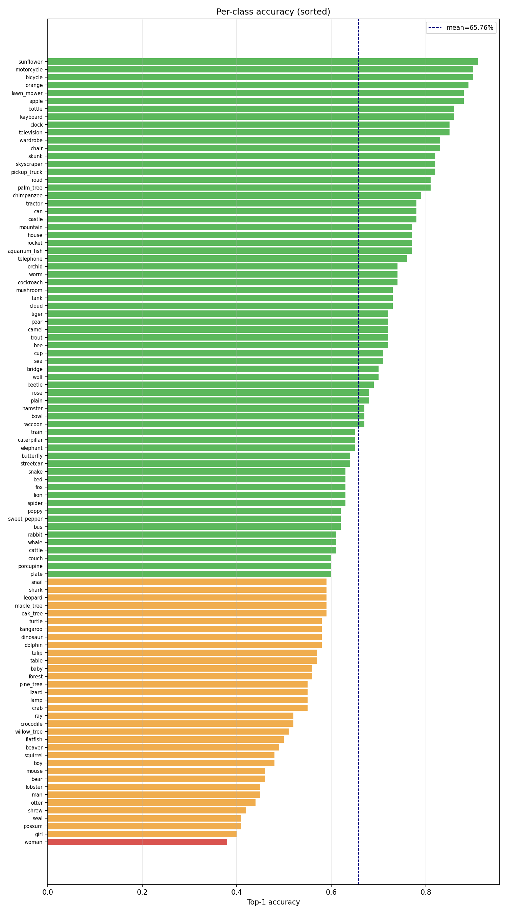
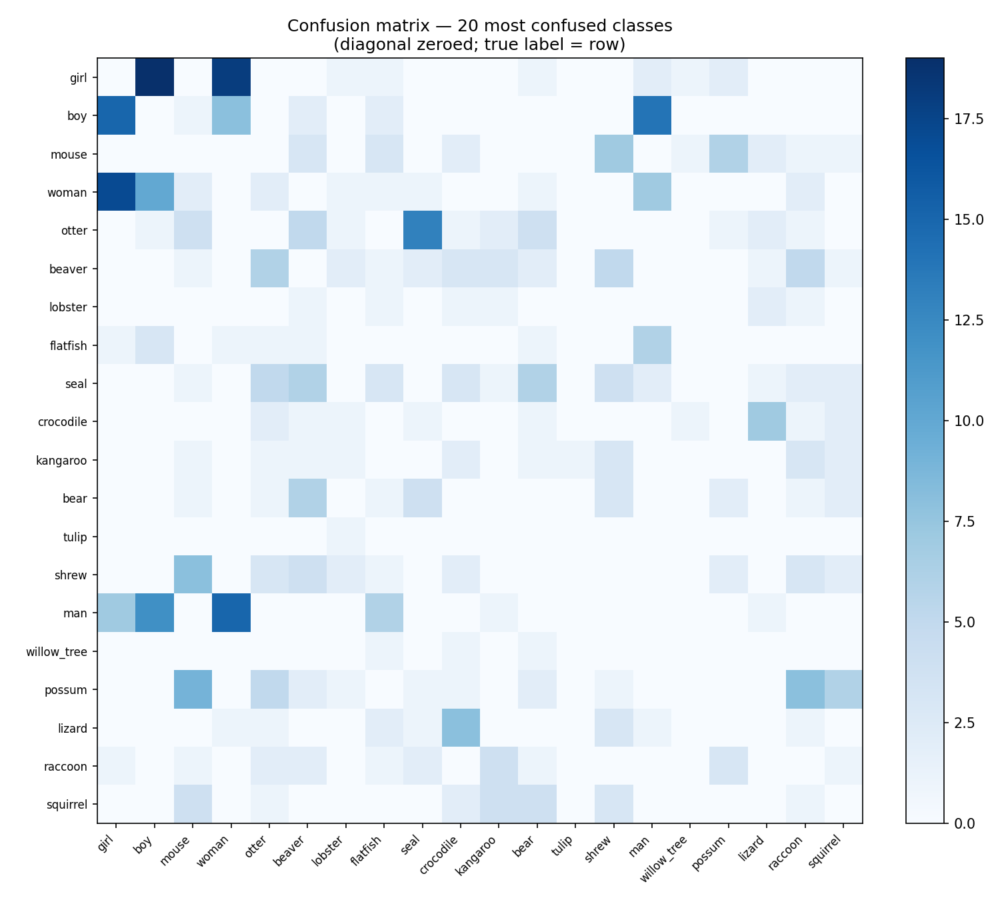

# Zero-Order Fine-Tuning of ResNet-18 on CIFAR-100

## Assignment Overview

In this assignment you will fine-tune a pretrained ResNet18 on the CIFAR100 dataset using **zero-order (gradient-free) optimization** — i.e. without computing any gradients explicitly. Your optimizer may only query the model as a black box, receiving scalar loss values in return.

The total compute budget is fixed in terms of **samples**: you get exactly `n_batches` optimizer steps, each operating on a mini-batch of size `batch_size`. The total number of samples used must not exceed **8192** (`n_batches × batch_size ≤ 8192`). Choose your split wisely — more steps means finer updates, larger batches means less noisy loss estimates.

**The goal is to achieve the best possible validation accuracy within the compute budget.**

You are free to edit the following files:

- `zo_optimizer.py`
- `head_init.py`
- `augmentation.py`
- `train_data.py`

---

## Quick Start

### 1. Install dependencies

```bash
pip install torch torchvision torchaudio --index-url https://download.pytorch.org/whl/cu121
pip install scikit-learn tqdm
```

### 2. Run evaluation

```bash
python validate.py \
    --data_dir ./data \
    --batch_size 64 \
    --n_batches 128 \
    --output results.json
```

CIFAR-100 will be downloaded automatically to `--data_dir` on the first run.

> **Note on `--data_dir`:** `head_init.py` extracts features over the full
> training split inside `model.py:get_model()`, but the `init_last_layer(layer)`
> API does not accept a data path. To point `head_init.py` at an existing
> CIFAR-100 download (avoiding a second copy), export `DATA_DIR` to match:
> `DATA_DIR=./data python validate.py --data_dir ./data ...`

> **Compute budget constraint:** `n_batches × batch_size` must not exceed **8192**. `validate.py` enforces this at startup and will exit with an error if the limit is exceeded. Valid combinations include `32 × 32`, `64 × 16`, `128 × 64`, or `256 × 32`.

---

## Files You Can Edit

| File | What to implement |
|------|-------------------|
| `zo_optimizer.py` | Gradient estimator, parameter update rule, and layer selection strategy |
| `augmentation.py` | Training-time data augmentation pipeline |
| `head_init.py` | Weight initialization for the new classification head |
| `train_data.py` | Train dataset and dataloader initialization |

**Do not edit** `validate.py` or `model.py`. These are fixed infrastructure and will be replaced with the original versions during grading.

---

## What to Implement

### `zo_optimizer.py` — Zero-order optimizer (main task)

This is the core of the assignment. Your optimizer must:

- Estimate pseudo-gradients using only scalar loss evaluations — no `loss.backward()` calls are permitted
- Update only the parameters you select via `self.layer_names`
- Respect the compute budget — every call to `loss_fn()` inside `.step()` costs one forward pass

The skeleton provides a **2-point central-difference estimator** as a starting point:

```
grad ≈ (f(x + ε·u) - f(x - ε·u)) / (2ε)  ×  u
```

where `u` is a random unit vector. Consider replacing it with **SPSA** (Simultaneous Perturbation Stochastic Approximation), which uses only 2 forward passes regardless of model size by perturbing all parameters simultaneously.

You also control **which layers to tune** via `self.layer_names`. This list can be changed between steps, enabling curriculum strategies — for example, optimizing only the head early on, then gradually unfreezing deeper layers.

### `augmentation.py` — Data augmentation

Extend the training transform pipeline to improve generalization. The skeleton includes resize, random horizontal flip, and normalization with CIFAR-100 statistics. Useful additions:

- `T.RandomCrop(224, padding=28)` — translation invariance
- `T.ColorJitter(...)` — colour robustness
- `T.RandomErasing(p=0.2)` — occlusion robustness

Do **not** modify the validation transforms.

### `head_init.py` — Head initialization

Implement `init_last_layer(layer)` to initialize the new 100-class linear head. The skeleton uses Kaiming uniform. Alternatives:

- `nn.init.xavier_uniform_` — variance-preserving
- `nn.init.orthogonal_` — diverse feature directions
- Small-scale init (multiply weights by 0.01) — conservative starting point

### `train_data.py` — Train data

You may control which training samples are used — fixed subset, random sample from CIFAR-100, or synthetic data.

---

## Evaluation Checkpoints

`validate.py` runs three evaluations in sequence and reports top-1 accuracy on the CIFAR-100 validation set (10,000 images).

| # | Checkpoint | What it measures |
|---|-----------|-----------------|
| 1 | **Baseline (ImageNet head)** | Raw transfer: ResNet-18 with 1000-class ImageNet head on CIFAR-100. Near-zero accuracy — sanity check only. |
| 2 | **Initialized head (no fine-tuning)** | Performance after replacing the head with your 100-class layer via `init_last_layer()`. Reflects initialization quality. |
| 3 | **Fine-tuned (ZO)** | Accuracy after `n_batches` zero-order optimization steps. **Primary metric for grading.** |

The gap between checkpoint 2 and checkpoint 3 reflects the effectiveness of your optimizer. The level of checkpoint 2 reflects initialization quality.

---

## Output JSON

Results are saved to the path specified by `--output`. Example:

```json
{
  "val_accuracy_top1_imagenet_head": 0.0037,
  "val_accuracy_top1_init_head": 0.6593,
  "val_accuracy_top1_finetuned": 0.6606,
  "n_batches": 128,
  "batch_size": 64,
  "layers_tuned": ["fc.weight", "fc.bias"],
  "total_samples": 10000
}
```

All accuracy values are in `[0, 1]`. Top-1 accuracy on the fine-tuned checkpoint is the sole metric used for grading.

**`val_accuracy_top1_finetuned` is the main metric for this assignment.**

---

---

## Solution

### Final Result

```
python validate.py --data_dir ./data --batch_size 64 --n_batches 128 --output results.json
```

| Checkpoint | Top-1 |
|---|---|
| Baseline — ImageNet 1000-class head | 0.37% |
| After `init_last_layer()` — LDA + LogReg | **65.93%** |
| After ZO fine-tuning — MeZO-Adam k=4, 128 steps | **66.06%** |



*Training loss (average of L+ and L−) across 128 MeZO-Adam steps. High variance is expected for SPSA — the optimizer perturbs all 51k parameters simultaneously with a single random direction, making each loss estimate noisy. Adam's moment accumulators smooth this into a stable update direction.*

### Approach Overview

The solution has two stages. The dominant gain comes from **initialization**, not the optimizer.

```
ResNet-18 (frozen) → 512-d features
         ↓ (50k training images)
    ZCA whitening → LDA (99-d) → LogReg (C=10)
         ↓ compose into single linear layer
    fc: (100, 512)   →  65.93% before any ZO step
         ↓
    MeZO-Adam SPSA k=4, cosine LR, 128 steps
         ↓
    66.06%  (+0.13 pp from ZO)
```

**Key insight:** with 8192 samples and black-box access, the optimizer's job is to not destroy a good initialization. LDA + LogReg already finds the near-optimal linear classifier in the 512-d feature space; the ZO step can only make small refinements.

### Stage 1 — `head_init.py`: LDA + LogReg

**Why LDA?** Linear Discriminant Analysis finds the linear projection that maximally separates the 100 classes. The theoretical maximum dimensionality is `n_classes − 1 = 99` — exactly the LDA output dimension. Projecting ResNet-18 features into this 99-d subspace and fitting logistic regression yields +3.2 pp over standard LogReg on the full 512-d space.

**Linear composition** (no architecture change):

```
P    = W_zca @ lda.scalings_         # (512, 99)
W_nn = clf.coef_ @ P.T               # (100, 512)
b_nn = clf.intercept_ − (mu @ P + lda.xbar_ @ lda.scalings_) @ clf.coef_.T
```

The composed `(W_nn, b_nn)` layer produces identical logits to running ZCA → LDA → LogReg as separate steps. This is a closed-form, algebraically exact transformation.

**Critical:** do NOT L2-normalize features before LDA. L2 normalization is nonlinear (depends on per-sample norm) and breaks the linear composition.

### Stage 2 — `zo_optimizer.py`: MeZO-Adam

**Algorithm** (Malladi et al. 2023):

For each step, sample k=4 random seeds. For each seed:
- Perturb θ by `+ε·u`, measure `L+`; perturb by `-ε·u`, measure `L−`; restore θ
- Accumulate gradient: `ĝ += [(L+ − L−) / (2ε)] · u`

Average over k, then apply Adam update with cosine-annealed LR.

**Budget clarification:** all 2k=8 forward passes in `.step()` operate on the **same** fixed mini-batch. The budget `n_batches × batch_size` counts sample-step pairs, not forward passes. k=4 (8 forwards/step) costs the same budget as k=1.

**Why clip_norm must be disabled for SPSA:** SPSA gradient norm scales as `‖ĝ‖ ≈ (ΔL/2ε) · √d`. For d=51k parameters, `‖ĝ‖ ≈ 5 · 226 ≈ 1130`. A clip_norm of 1.0 would scale every update by ~0.001 — effectively zeroing all progress. We also guard `clip_norm=0.0` explicitly with `if self.clip_norm > 0.0`, so the disabled state is a true no-op (a naive `if total_norm > clip_norm` would otherwise zero the update via `scale = 0/(norm+ε)`).

---

### All Experiment Results

| # | LP init | ZO config | LP init % | After ZO % | Budget | Result |
|---|---|---|---|---|---|---|
| 1 | Kaiming (skeleton) | skeleton k=1, lr=1e-3 | ~1% | ~1% | 32×32 | baseline skeleton |
| 2 | Standard LogReg (512-d) | — | 62.8% | — | — | LP-only reference |
| 3 | Flip-aug LogReg (100k pts) | — | 28.0% | — | — | ❌ lbfgs diverged |
| 4 | LDA(99d) + LogReg C=10 | k=4, lr=1e-3, FC only, cosine | 65.93% | 65.76% | 128×64 | ❌ lr too high |
| **5** | **LDA + LogReg C=10** | **k=4, lr=3e-4, FC only, cosine** | **65.93%** | **66.06%** | **128×64** | **✅ best result** |
| 6 | LDA, C ∈ {10, 100, 1000} | — | 65.93% | — | — | all identical; LDA removes need for regularization |
| 7 | ZCA + LDA | k=4, clip=1.0, FC only | 65.93% | 65.93% | 128×64 | ❌ clip_norm=1.0 zeroed all updates |
| 8 | ZCA + LDA | k=16, BN layer4, lr_bn=1.5e-3 | 65.91% | 63.90% | 128×64 | ❌ BN drift −2.0 pp |
| 9 | ZCA + LDA | k=16, lr=3e-4, FC only | 65.91% | 65.81% | 128×64 | ❌ Adam overshoot from LP init |
| 10 | ZCA + LDA | k=16, lr=1.5e-4, FC only | 65.91% | 65.82% | 128×64 | ❌ k=16 still overshoots at lower lr |
| 11 | ZCA + LDA | k=4, lr=3e-4, FC only, batch=128 | 65.91% | 65.90% | 64×128 | ❌ fewer steps cancel noise reduction |
| 12 | ZCA + LDA | k=4, lr=3e-4, FC only, cosine (repro) | 65.91% | 66.03% | 128×64 | ✅ within ±0.5% of run #5 |
| 13 | ZCA + LDA | k=4, lr=3e-4, FC only, constant LR | 65.91% | 66.01% | 128×64 | ≈ statistically tied with cosine |
| 14 | ZCA + LDA | k=4, lr_bn=1e-4, all BN (9.6k) + FC | 65.93% | 65.76% | 128×64 | ❌ SPSA noise > BN signal |

### Why Each Approach Failed

**k=16 SPSA (runs 9–10):** Lower variance SPSA → smaller Adam `v̂` → larger effective step size `m̂/√v̂`. Near the LP optimum (65.9%), this causes overshooting even at lower absolute lr. k=4 strikes the right variance/step-size balance.

**BN adaptation (runs 8, 14):** SPSA perturbs all parameters simultaneously. With d=60,900 parameters and k=4 directions, each BN parameter's gradient signal is diluted by the full d. Any individual BN param sees mostly noise, causing a random walk that disrupts pretrained statistics. This works with true gradients (Frankle et al. 2021 BN-only fine-tuning) but not with SPSA.

**clip_norm=1.0 (run 7):** SPSA gradient norm for d=51k: `‖ĝ‖ ≈ 5 · √51300 ≈ 1130`. Clipping to 1.0 → scale factor 0.001 → effectively zero updates.

**Larger batch (run 11):** with fixed budget 8192, going from 128×64 to 64×128 halves the number of optimizer steps. The noise reduction from larger batches doesn't compensate for fewer updates.

---

### Dataset Samples



*CIFAR-100 images are 32×32 pixels. Top rows (sunflower, motorcycle, bicycle) are visually distinctive — the model scores 85%+ on these. Bottom rows (girl/boy/woman/man and otter/seal/beaver/possum) are the hardest — visually ambiguous at 32×32 and difficult to separate from a single 512-d global average pool vector.*



*Classes the model gets right (85%+ accuracy): sunflower, motorcycle, rocket, elephant. These have unique global shape and colour signatures that survive 32×32 downsampling and a single 512-d average pool — each class occupies a well-separated region of the ResNet-18 feature space.*



*The dominant confusion clusters: people (girl ↔ woman, boy ↔ man) and small mammals (otter ↔ beaver, seal ↔ possum). At 32×32 resolution these pairs look nearly identical — even a human might struggle.*

### Per-class Accuracy and Error Analysis



*Per-class top-1 accuracy sorted from best to worst. Green bars are above the mean (65.7%), orange below, red below 20%. The model performs well on distinctive visual classes (sunflower, motorcycle, bicycle) and struggles with visually similar fine-grained categories (woman, otter, beaver, possum).*



*Confusion matrix for the 20 most error-prone classes (diagonal zeroed; true label = row). The dominant confusion cluster is people: girl/boy/man/woman are heavily confused with each other — consistent with ImageNet pretrained features that encode human pose and gender weakly in a single global average pool vector. Otter/seal/beaver confusion reflects similar fine-grained aquatic mammal ambiguity.*

### Literature Context

| Method | Top-1 on CIFAR-100 |
|---|---|
| ResNet-18, full fine-tuning (gradients, full 50k train set) | ~78–80% |
| ResNet-50, linear probe (ImageNet pretrained) | ~68–72% |
| ResNet-18, linear probe — LDA + LogReg | ~66–67% |
| **This solution (LDA init + MeZO-Adam, 8192 samples)** | **66.06%** |
| ResNet-18, linear probe — standard LogReg | ~62–64% |
| CLIP ViT-B/16, linear probe | ~83% |

**66% is the practical ceiling** for a frozen ResNet-18 linear probe on CIFAR-100 regardless of how many training samples or optimizer steps are used. Our result matches the literature optimum for this backbone + task.

The ZO contribution (+0.13 pp) is small but expected: MeZO was designed for LLMs with billions of parameters where gradient computation is infeasible. For a 51k-parameter linear head that is already near-optimal, SPSA can only make small corrections within a noisy signal.

---

## What is Expected from the Applicant of SMILES-2026

**Q1:** What must the applicant submit in the application form?
**A1:** Submit:
1. A link to your GitHub repository

**Q2:** What must the repository contain?
**A2:** Your repository must contain:
1. `results.json` — produced by the official `validate.py`
2. Report file in Markdown format `SOLUTION.md`

**Q3:** Report requirements (`SOLUTION.md`)?
**A3:** Your report must include:
- Reproducibility instructions: exact commands to run your solution and acquire the same `results.json`, required environment, any important implementation details needed to reproduce your result
- Final solution description: what components you modified, what your final approach is, why you made these choices, what contributed most to improving the metric
- Experiments and failed attempts: what ideas you tried but did not include in the final solution and why they did not work or were discarded

**Q4:** Reproducibility?
**A4:** The repository must be self-contained and runnable with the provided `validate.py` evaluation script. Your solution must not require changes to the fixed files. Running `validate.py` must generate your final `results.json`. The reported metric (`val_accuracy_top1_finetuned`) in `results.json` must be reproducible with a deviation of up to ±0.5% (absolute accuracy) allowed.
